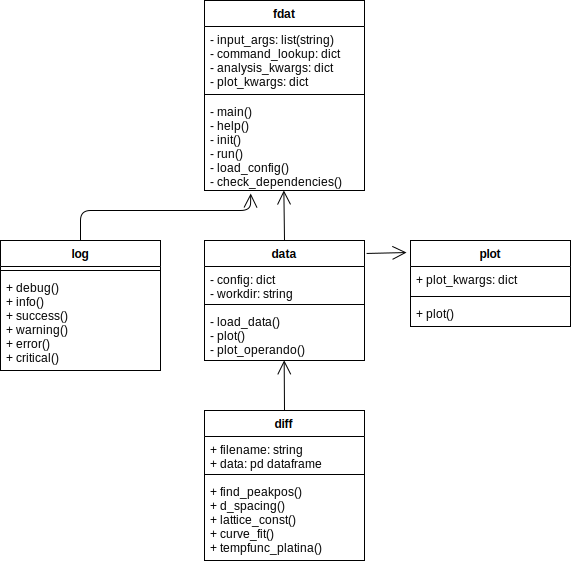

# fdat

**Fast Diffraction Analysis Tool**

fdat is a small software toolkit for easy visualization and lightweight analysis of diffractograms. It has been made for X-Ray diffractograms, but can ofcourse also be used for diffractograms from other radiation types like neutrons.

# Getting started
Install fastdiff by cloning the repository and running the setup.py

Current features:

- Plotting of multiple diffractograms with possibility to zoom in on peaks
- Specific-Peak detection for lattice constant determination (so far only Platina data added)

# Dependencies
- Dans_Diffraction
- numpy, matplotlib, scipy, pandas

# UML Chart

